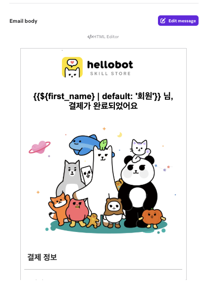

# 브레이즈 활성 캠페인/캔버스/속성값 정리 (테이블 정리본)

> **출처**: 마케팅팀 Judy Yang 작성 Notion 문서 (최종 편집 2026-06-11)
> **용도**: TODO-035 트랙 B Braze 이관 — **6/12 데이터 백필 + 신규 대시보드 캠페인 세팅**의 마이그레이션 대상 인벤토리
> **⭐ = 마케팅팀 지정 검토 우선순위 항목** (캔버스 4건 + 캠페인 12건 = 16건)
> 신규 계정으로는 대시보드 "Copy to workspace" 불가 → 전 건 수동 재제작 전제 (TODO-035 6/11 조사 결과)

## 1. 캔버스 정리

### 메인 캔버스

| ⭐ | 캔버스명 | 운영 기간 | 대상자 조건 | 액션 / 플로우 | 발송 모수 |
|:--:|---|---|---|---|---:|
| ⭐ | [쿠폰만료임박_푸시](https://dashboard-07.braze.com/engagement/canvas/6840fc719015d50066c95ced/67eccf8d2b4a0b0067e42740?locale=en&version=flow&isEditing=false) | 25.06.05~ | custom event '쿠폰 만료 임박' 충족 + 앱 접속 중인 유저(잠금화면은 수신 불가) | 만료 하루 전 안내 → 쿠폰 사용 유도 | 81,277 |
| ⭐ | [always_on 푸시 동의 유도 팝업](https://dashboard-07.braze.com/engagement/canvas/68b150a385c3ab006729bcba/67eccf8d2b4a0b0067e42740?locale=en&isEditing=true&step=build) | 25.08.29~ | 주간 푸시 미허용 유저 | 최근 7일 스킬 구매 여부로 멘트 분기, 약 3일간 앱 진입 시 인앱메시지 → 3일째 푸시 on 시 쿠폰 지급 | 약 80,000 |
| | [always_on 5~10만원 결제_하트 20개 지급](https://dashboard-07.braze.com/engagement/canvas/68ba840ff923b40076df2b50/67eccf8d2b4a0b0067e42740?locale=en&isEditing=true&step=basics) | 09.05~ | 최근 30일 누적 결제 $36 초과~$72 미만 | 20하트 지급 → 재방문·추가 결제 유도 (실험/대조군) | 9,127 |
| | [always_on 10~20만원 결제_하트 50개 지급](https://dashboard-07.braze.com/engagement/canvas/68ba874a51e0730065c394a6/67eccf8d2b4a0b0067e42740?locale=en&isEditing=true&step=basics) | 09.05~ | 최근 30일 누적 결제 $73 초과~$143 미만 | 50하트 지급 → 재방문·추가 결제 유도 (실험/대조군) | 1,966 |
| | [always_on 20만원~ 결제_하트 100개 지급](https://dashboard-07.braze.com/engagement/canvas/68ba891e51e0730065c3a01c/67eccf8d2b4a0b0067e42740?locale=en&isEditing=true&step=basics) | 09.05~ | 최근 30일 누적 결제 $144 초과 | 100하트 지급 → 재방문·추가 결제 유도 (실험/대조군) | 428 |
| | [always_on 속마음구매자_14일 이탈](https://dashboard-07.braze.com/engagement/canvas/68ba75c87ea4000075896660/67eccf8d2b4a0b0067e42740?step=audience&isEditing=true&locale=en) | 09.05~ | 마케팅 푸시 동의 + segment extension '속마음_구매자_30일 이내' + 미접속 4일째 (2주 후 재충족 시 재발송 가능) | 50% 할인 쿠폰으로 복귀·추가 구매 유도 (실험/대조군) | 4,354 |
| | [always_on 재회구매자_14일 이탈](https://dashboard-07.braze.com/engagement/canvas/68ba6fa5f895310076ab5b75/67eccf8d2b4a0b0067e42740?locale=en&isEditing=true&step=basics) | 09.05~ | 마케팅 푸시 동의 + segment extension '재회_구매자_30일 이내' + 미접속 4일째 (2주 후 재발송 가능) | 50% 할인 혜택으로 복귀·추가 구매 유도 (실험/대조군) | 6,354 |
| | [관심사별_임신_연속flow](https://dashboard-07.braze.com/engagement/canvas/692933cd79fd69006346a5ed/67eccf8d2b4a0b0067e42740?locale=en&isEditing=true&step=basics) | 25.12.02~ | segment extension 임신관심자 + 마케팅 수신 동의 | 푸시 미반응 임신 관심군을 1개월 주기로 터치 | 74,828 |
| | [내 팔자에 새겨진 천년배필_미구매자](https://dashboard-07.braze.com/engagement/canvas/6837ebf46eb24e00655ad566/67eccf8d2b4a0b0067e42740?locale=en&isEditing=true&step=basics) | — | 마케팅 푸시 동의 + 스킬 상세 확인 1시간 후 미구매 시 발송, 하루 후에도 미구매면 할인 링크 푸시 | 리마인드 푸시 → 다음날 혜택 지급으로 구매 전환 유도 | 17,695 |
| ⭐ | [always_on 이탈유저 복귀](https://dashboard-07.braze.com/engagement/canvas/68b93bfd8d936b0074a032e4/67eccf8d2b4a0b0067e42740?locale=en&isEditing=true&step=audience) | 09.05~ | 최근 1주 이상 미접속한 마케팅 푸시 동의자 | 1차: 잔여하트 없는 유저 리마인드 → 2차: 하루 뒤 3만원 이상 결제(segment)·잔여하트 유무별 혜택 (실험/대조군) ※ 추후 세팅 시 결제 분기 제거 가능 의견 | 302,900 |
| ⭐ | [신규 유저 Onboarding(쿠폰 제외)](https://dashboard-07.braze.com/engagement/canvas/69b3808978dcca0063a31692/67eccf8d2b4a0b0067e42740?locale=en&isEditing=true&step=basics) | 26.03.13~ | 첫 사용 2일 이내 마케팅 푸시 동의자, 앱 실행 시 발송 | 1차 관심사별 스킬 랜딩 → 2차 무료운세 탭 → 3차 할인 스킬 → 4차 무료 하트 이벤트 | 13,163 |
| | [always_on 초기 이탈유저복귀 푸시_1·2·3일](https://dashboard-07.braze.com/engagement/canvas/69ba5a81bda94f0063fa74b5/67eccf8d2b4a0b0067e42740?locale=en&isEditing=true&step=basics) | 03.18~ | 사용 후 24/48/72시간 경과한 마케팅 수신 동의자 | 잔여하트 유무 분기 → 관심사별 스킬 랜딩 (실험/대조군) | 약 110,000 (중복 포함) |
| | [morning_오늘의 운세](https://dashboard-07.braze.com/engagement/canvas/6912ddbe211de800649d5548/67eccf8d2b4a0b0067e42740?locale=en&isEditing=true&step=basics) | 25.11.12~ | — | **현재 중단**이나 자동 발송 푸시라 세팅 방식 보존 필요 | — |

### 26.03 연령대별 앱푸시 (93~02년생 대상)

> 원문 메모: 대부분 모수가 적어 **공수가 많이 들 경우 추가 세팅 생략 가능**

| 캔버스명 | 대상자 조건 | 액션 | 발송 모수 |
|---|---|---|---:|
| [26.03.20~] 오늘 5,000원 미만 결제자 혜택 (원문에 링크 없음) | 오늘 1,500원~5,000원 미만 결제자 + 93~02년생 + 마케팅 동의 | 10하트 쿠폰 지급 → 오늘 즉각 구매 유도 | 477 |
| [20만원 이상~50만원 미만 및 오늘 미구매자 혜택](https://dashboard-07.braze.com/engagement/canvas/69b2964fa2d4b200637de807/67eccf8d2b4a0b0067e42740?locale=en&isEditing=true&step=audience) | 마케팅 동의 + 93~02년생 + 22~26년 20만~50만원 구매(csv) + 최근 24h 미구매 | 30하트 지급 → 오늘 즉각 구매 유도 | 7 |
| [연애→재회유저 혜택](https://dashboard-07.braze.com/engagement/canvas/69bcf08319bba5006356d8cb/67eccf8d2b4a0b0067e42740?locale=en&isEditing=true&step=basics) | 마케팅 동의 + 93~02년생 + 최근 1년 연애 카테고리 구매(csv) + 매출 top10 재회 스킬 상세 조회 시 | 교차 카테고리 조회 시 맞춤 푸시 → 구매 전환 | 1 |
| [연애→궁합유저 혜택](https://dashboard-07.braze.com/engagement/canvas/69bcf0f1203a5f0063fcedba/67eccf8d2b4a0b0067e42740?locale=en&isEditing=true&step=basics) | 동일 + 매출 top10 궁합 스킬 상세 조회 시 | 〃 | 4 |
| [신년→연애유저 혜택](https://dashboard-07.braze.com/engagement/canvas/69bcf15207947c0072ab1216/67eccf8d2b4a0b0067e42740?locale=en&isEditing=true&step=basics) | 최근 1년 신년 카테고리 구매(csv) + 매출 top10 연애 스킬 상세 조회 시 | 〃 | 4 |
| [과거 20만원 미만 5만원 이상 결제 + 오늘 탐색·미구매](https://dashboard-07.braze.com/engagement/canvas/69bcf202a46c5e0064906bda/67eccf8d2b4a0b0067e42740?locale=en&isEditing=true&step=basics) | 마케팅 동의 + 최근 1년 5만~20만원 결제(csv) + 93~02년생 + 스킬 상세 조회 후 1시간 내 미결제 | 혜택 지급으로 즉각 구매 전환 유도 | 36 |
| [무료유저 혜택](https://dashboard-07.braze.com/engagement/canvas/69b9fcc29e29d90063ba5c89/67eccf8d2b4a0b0067e42740?locale=en&isEditing=true&step=basics) | 마케팅 동의 + 93~02년생 + 구매 이력 없음 + 1년 내 접속 + 오늘 무료 스킬 소비 시 20분 뒤 발송 | 저가 스킬 무료 체험 제공 → 결제 전환 유도 | 2,204 |

## 2. 캠페인 정리

| ⭐ | 캠페인명 | 대상자 조건 / 트리거 | 액션 | 발송 모수 |
|:--:|---|---|---|---:|
| ⭐ | [AI 프로필 결제 완료 > 알림톡](https://dashboard-07.braze.com/engagement/campaigns/68088041aea9f900620ede61/67eccf8d2b4a0b0067e42740?locale=en&page=-2) | '트레이닝 프로젝트 결제 완료' 이벤트 충족 시 | AI 프로필 결제 완료 안내 | 98 |
| ⭐ | [회원가입 유도 [25.04.24~]](https://dashboard-07.braze.com/engagement/campaigns/6809a92762ec330082eddc12/67eccf8d2b4a0b0067e42740?locale=en&campaignName=%5B25.04.24~%5D%20%ED%9A%8C%EC%9B%90%EA%B0%80%EC%9E%85%20%EC%9C%A0%EB%8F%84&page=0) | 미가입 유저(segment), 홉 탭/히트 탭 클릭·홈 하위 탭 진입 시 인앱 | 10하트 지급 소구로 회원가입 유도 — **현재 중단, 추후 세팅 가능성 있어 속성값 필요** | — |
| | [내 사주 일복 구매 후 레퍼럴 안내](https://dashboard-07.braze.com/engagement/campaigns/68832bff33c2c10085ea9b1b/67eccf8d2b4a0b0067e42740?locale=en&page=-2) | 마케팅 수신 동의 + '내 사주 일복' 스킬 소비 30분 뒤 | 결과 이미지 탭 이동 → 혜택 안내·재방문 유도 | 227 |
| ⭐ | [오늘의 운세 확인 직후_오전푸시ON팝업 [25.05.13~]](https://dashboard-07.braze.com/engagement/campaigns/6822ec5c96ea34006599e94c/67eccf8d2b4a0b0067e42740?locale=en&page=-2) | 오늘의 운세 푸시 미허용 + '오늘의' 포함 스킬 소비 후 4분 이내 | 오늘의 운세 관심군에 푸시 on 유도 | 525,285 |
| ⭐ | [회원가입 직후 푸시](https://dashboard-07.braze.com/engagement/campaigns/6809d0ff42999f0061ddfd7f/67eccf8d2b4a0b0067e42740?locale=en&page=-2) | 마케팅 푸시 동의 + 회원가입 성공 즉시 | 신규 가입자 하트 구매 유도 푸시 | 26,275 |
| ⭐ | [회원가입 직후_온보딩 하트 안내 (restart) [25.12.04~]](https://dashboard-07.braze.com/engagement/campaigns/69311f9ea8efdb00632b551a/67eccf8d2b4a0b0067e42740?locale=en&page=-2) | 모든 유저, 회원가입 성공 1분 뒤 (상단 인앱) | 신규 가입자 하트 구매 유도 인앱메시지 | 21,041 |
| ⭐ | [쿠폰 발급_푸시](https://dashboard-07.braze.com/engagement/campaigns/6846a547ec5bf20066cd32d0/67eccf8d2b4a0b0067e42740?locale=en&campaignName=%EC%BF%A0%ED%8F%B0%20%EB%B0%9C%EA%B8%89_%ED%91%B8%EC%8B%9C&page=0) | 마케팅 푸시 동의 + 쿠폰 발급 직후 | 쿠폰 발급 알림 | 125,666 |
| ⭐ | [스킬스토어 결제완료 > 이메일](https://dashboard-07.braze.com/engagement/campaigns/67f64863667136006576ecc1/67eccf8d2b4a0b0067e42740?locale=en&campaignName=%EC%8A%A4%ED%82%AC%EC%8A%A4%ED%86%A0%EC%96%B4%20%EA%B2%B0%EC%A0%9C%EC%99%84%EB%A3%8C%20%3E%20%EC%9D%B4%EB%A9%94%EC%9D%BC&page=0) | 모든 유저, 스킬 결제 완료 즉시 | 결제 완료 안내 이메일 | 221,480 |
| ⭐ | [결과 보고서 결과 푸시 발송](https://dashboard-07.braze.com/engagement/campaigns/69b80a60c1d08500633ab47b/67eccf8d2b4a0b0067e42740?locale=en&page=-2) | 모든 유저, **API-triggered** | 결과 보고서 제작 완료 알림 | 1,099 |
| ⭐ | [스킬스토어 결제완료 > 알림톡](https://dashboard-07.braze.com/engagement/campaigns/67f641b6817cae00752dc0e2/67eccf8d2b4a0b0067e42740?locale=en&page=-2) | 모든 유저, 스킬 결제 완료 즉시 | 결제 완료 안내 알림톡 | 319,942 |
| ⭐ | [[LLM]티켓만료임박_푸시](https://dashboard-07.braze.com/engagement/campaigns/6a154cb67fc75b00832b048a/67eccf8d2b4a0b0067e42740?locale=en&campaignName=%5BLLM%5D%ED%8B%B0%EC%BC%93%EB%A7%8C%EB%A3%8C%EC%9E%84%EB%B0%95_%ED%91%B8%EC%8B%9C&page=0) | 마케팅 푸시 동의 + 'hellobotllm 티켓 만료 임박' 이벤트 직후 | 자유상담권 만료 알림 | 1,596 |
| ⭐ | [[LLM]티켓 발급_푸시_스킬구매혜택](https://dashboard-07.braze.com/engagement/campaigns/6a154d78d27ab10083834e1c/67eccf8d2b4a0b0067e42740?locale=en&campaignName=%5BLLM%5D%ED%8B%B0%EC%BC%93%20%EB%B0%9C%EA%B8%89_%ED%91%B8%EC%8B%9C_%EC%8A%A4%ED%82%AC%EA%B5%AC%EB%A7%A4%ED%98%9C%ED%83%9D&page=0) | 마케팅 푸시 동의 + 'hellobotllm 티켓 받기 안내' 이벤트 직후 | 자유상담권 발급 알림 | 2,966 |
| ⭐ | [[LLM]티켓 발급_푸시_구독권혜택](https://dashboard-07.braze.com/engagement/campaigns/6a154de3f7ff31008322fb1c/67eccf8d2b4a0b0067e42740?locale=en&page=-2) | 마케팅 푸시 동의 + 'hellobotllm 티켓 발급' 이벤트 직후 | 자유상담권 발급 알림 | 301 |

## 3. 속성값 정리 (백필 대상)

> 현재 활성 캔버스·캠페인에서 사용 중인 속성값만 정리한 것 (전체 속성값 아님) — 원문 주석

### 캔버스 공통

| 구분 | 속성값 | 타입/비고 |
|---|---|---|
| [custom event](https://dashboard-07.braze.com/app_settings/app_settings/custom_events/67eccf8d2b4a0b0067e42740?locale=en) | 쿠폰 만료 임박 / 스킬 구매 / 홈 탭 클릭 / 스킬 진입 / 스킬 상세 확인 / 스킬 결제 완료 / 스킬 소비 | 링크 → manage properties에서 property·타입 확인 가능 |
| [custom attributes](https://dashboard-07.braze.com/app_settings/app_settings/custom_attributes/67eccf8d2b4a0b0067e42740?locale=en) | 주간 푸시 허용여부 / 야간 푸시 허용여부 / 오늘의 운세 푸시 허용여부 | Boolean |
| | 잔여 하트 개수 / 생년 / user id(고유번호) | Number |
| | 생월 / 생일 / 성별 / 별자리 / 이름 | String |
| event property | menu_name, menu_title (스킬명) / price, current_price (가격) / subject (주제: 썸·짝사랑·연애 등) / target (예: 상대무, 연애상태_싱글) | 이벤트에 붙는 세부 정보 |

### 캠페인별 필요 속성

| 캠페인 | 종류 | 속성값 | 비고 |
|---|---|---|---|
| AI 프로필 결제 완료 알림톡(인앱메시지) | event property | phone_number, product_title, transaction_id, product_current_price, spent_cash_currency | Braze 이벤트 프로퍼티로 전달 필요 |
| 스킬스토어 결제완료 이메일 | event property | product_title, product_current_price, chatbot_seq | **first_name 적재 여부 확인 요청** ← 아래 「확인 요청 사항」 참조 |
| 회원가입 유도 | custom event | 홉 탭 클릭, 히트 탭 클릭, 홈 하위 탭 진입, 회원가입 성공 | |
| | custom attribute | 가입 여부 | Boolean |
| 내 사주 일복 레퍼럴 | event property | menu_seq (스킬 고유번호) | |
| 오늘의 운세 푸시 ON 팝업 | custom attribute | 오늘의 운세 푸시 허용여부 | |
| 회원가입 직후 하트 구매 유도 | custom event | 회원가입 성공 | |
| 쿠폰 발급 푸시 | custom event | 쿠폰 발급 | |
| 결과보고서 결과 푸시 | — | (속성값 아님) | **Braze Campaign Trigger API 호출 필요** ← 아래 「확인 요청 사항」 참조 |
| 결제완료 > 알림톡 | custom event | 쿠폰 발급 | ⚠ 원문 표기 그대로 — 결제완료 캠페인인데 이벤트가 '쿠폰 발급'으로 기재. '스킬 결제 완료' 오기 가능성 → 마케팅팀 확인 필요 |
| | basic property | phone_number | |
| LLM 티켓만료임박 | custom event | hellobotllm 티켓 만료 임박 | |
| LLM 스킬구매 혜택 | custom event | hellobotllm 티켓 받기 안내 | |
| LLM 구독권 혜택 | custom event | hellobotllm 티켓 발급 | |

## 마케팅팀 → 개발 측 확인 요청 사항 (원문에서 발췌)

1. **first_name 적재 여부 확인** (스킬스토어 결제완료 이메일) — first_name은 Braze 기본 사용자 속성이라 이벤트 property 요청 대상은 아니나, 기존 메일 템플릿이 first_name을 사용 중. 신규 대시보드/유저 프로필에 first_name이 실제 적재되는지 확인 요청. 확인이 어려우면 마케팅팀이 현재 푸시에서 쓰는 버전으로 수정 예정.
   
2. **결과보고서 결과 푸시 — Campaign Trigger API 세팅 확인** — API-Triggered 방식이므로 서버에서 Braze Campaign Trigger API 호출 필요. 혁수님 세팅으로 추정되며 확인 요청.
3. (정리 중 발견) **'결제완료 > 알림톡'의 custom event가 '쿠폰 발급'으로 기재** — 오기 가능성 있어 마케팅팀에 역확인 필요.
